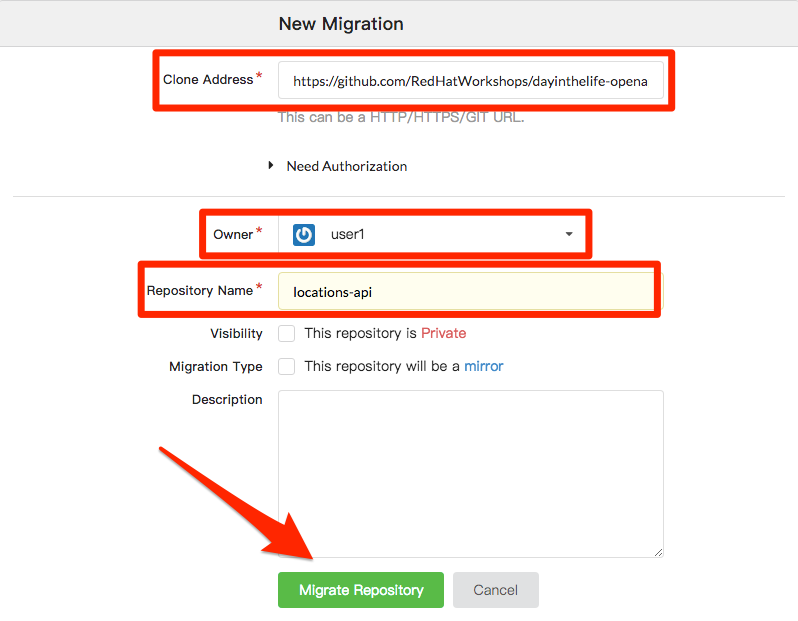
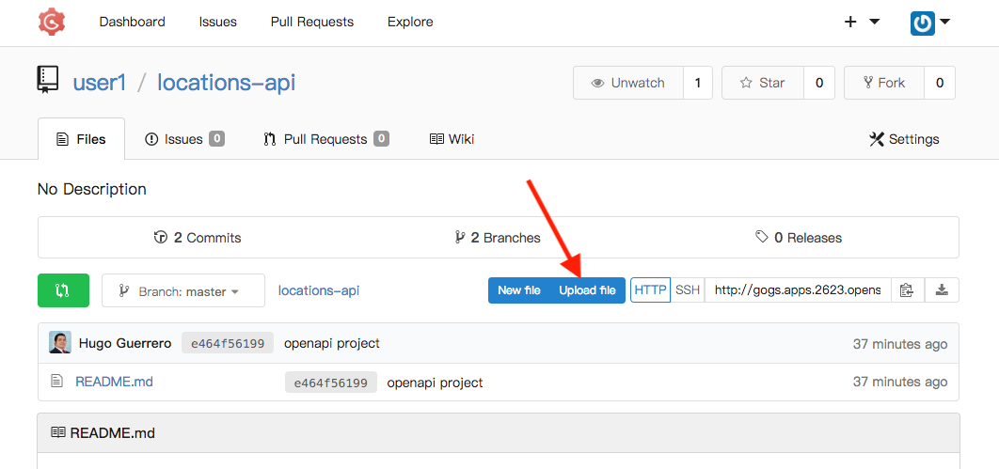
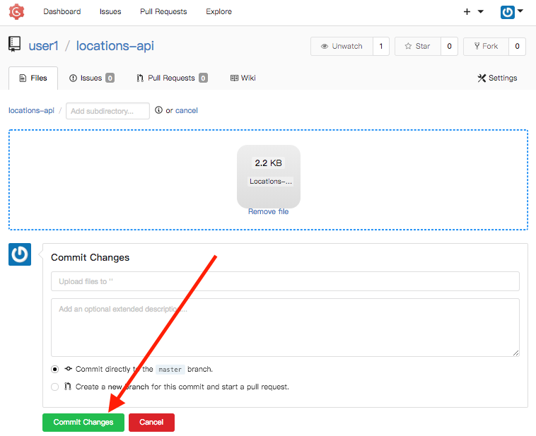
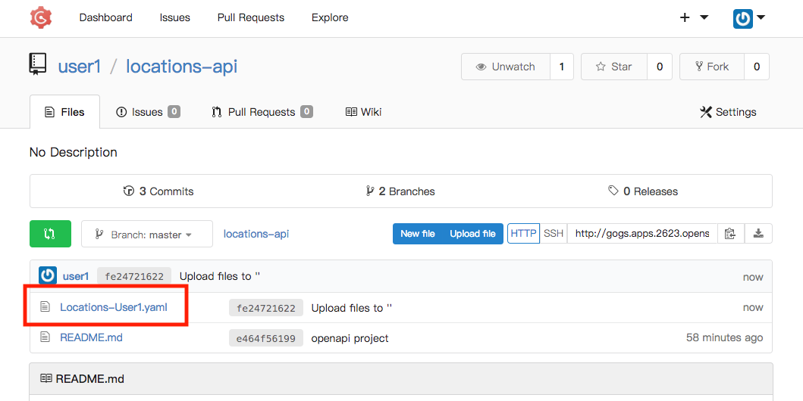
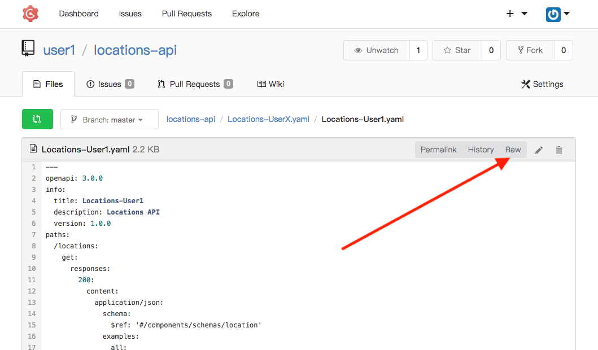
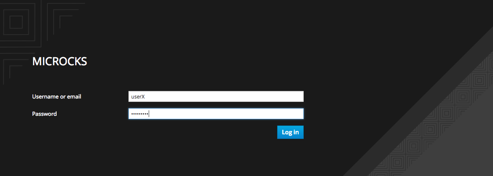
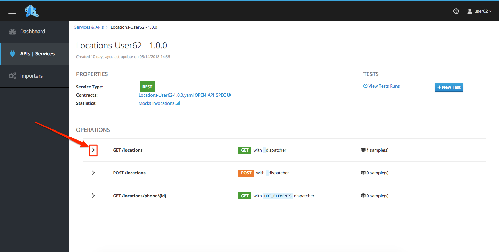
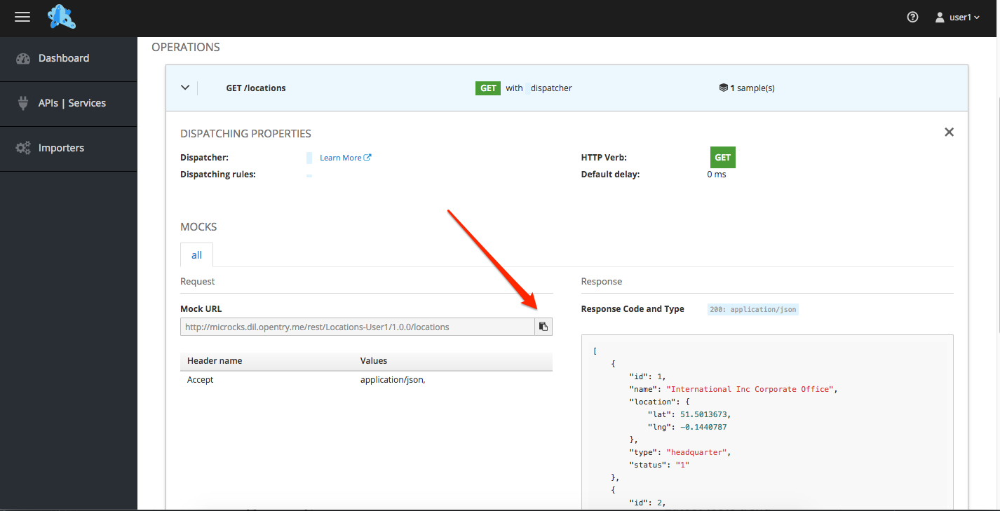
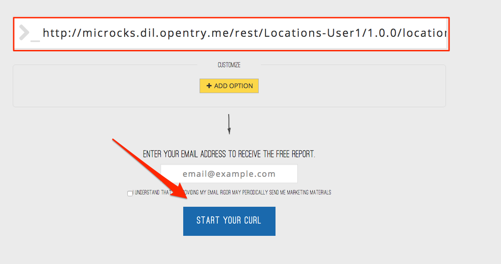
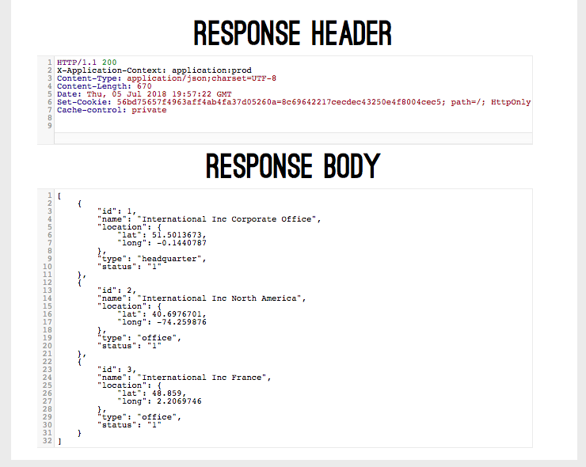

# Lab 2

## API Mocking

### Bring your APIs to life

* Duration: 20 mins
* Audience: Developers, Architects, Testers, Quality Engineers

## Overview

When building and working with APIs, you often need to simulate the responses of the system before it has been fully completed. This is what we explore in this workshop - mocking up API structures quickly so they can be subjected to testing withouth having to create all the final service code.

### Why Red Hat?

Red Hat combines a number of commercial and Open Source tools to cover each part of the API Design lifecycle. In this lab we'll be using the [Microcks](http://microcks.github.io/) open source tool.

### Skipping The Lab

We know that you don't always have enough time to go over step by step labs, so here is a [short video](wip-link) where you can see how to mock the API you previously created using Microcks.

If you are planning to follow the next lab, here is a [link](wip-link) to the REST mock service running the Location API.

### Environment

**Credentials:**

Your username is your assigned user number. For example, if you are assigned user number **1**, your username is: 

```bash
user1
```

Please ask your instructor for your password.

**URLs:**

If you haven't done so already, you need to login to the **Red Hat Solution Explorer** webpage so that a unique lab environment can be provisioned on-demand for your exclusive use.  You should open a web browser and navigate to: 

```bash
https://tutorial-web-app-webapp.dil.opentry.me
```

You will be presented with a login page where you can enter your unique credentials:


Enter your credentials and click **Log in**.  You'll notice a web-page appear which explains that a *unique environment* is being provisioned.


Once the environment is provisioned, you will be presented with a page that presents all the available applications which you'll need in order to complete the labs:


## Lab Instructions

### Step 0: Setup the collaboration environment using Git (Gogs)

For this lab we require a collaboration environment based on Git. You can use GitHub, GitLab or other Git provider to finish this lab. If you don't want to use your personal account, the provided lab environment has an user provided for you in Gogs. 

Follow this instructions to set up the repository.

1. Open a browser window and navigate to:

    ```bash
    http://gogs.dil.opentry.me/
    ```

1. Log into Gogs using your designated [user and password](#environment). Click on **Sign In**.

    

1. In the main page, click in the **+** sign in the right top corner to display the *New* menu. Click the **New Migration** option.

    

1. Fill in the information of the repository migration with the following values:

    * Clone Address: **https://github.com/RedHatWorkshops/dayinthelife-openapi.git**
    * Owner: **UserX**
    * Repository Name: **locations-api**

    

1. Click on **Migrate Repository** to fork the GitHub repo into Gogs.

1. Click on **Upload File** to load the OpenAPI Specification you created and download in [Lab 1](lab01.md).

    

1. Select the file from your local disk folder where you downloaded the file.

    

1. Click on the **Commit Changes** button to commit the file.

1. Click the filename link **Locations-UserX.yaml** to open and review the file.

    

1. If everything is fine, click the **RAW** button to get the raw download version of the file.

    

1. Copy the browser tab URL. Store that URL address as you will use it in the next steps of the lab. The URL should look like the following:

    ```bash
    http://gogs.dil.opentry.me/userX/locations-api/raw/master/Locations-UserX.yaml
    ```

    *If you feel more comfortable, you can also copy and paste the RAW button link from the previous step.  Don't forget to update the `X` variable with your user number*.

### Step 1: Create a Microcks Job

1. Open a browser window and navigate to:

    ```bash
    http://microcks.dil.opentry.me
    ```

1. Log in into Microks using your designated [user and password](#environment).

    

1. You are now in the main Microcks page. Click the **Importers** button to access the Importers page.

    

1. Click the **Create** button to create your first job.

1. In the `Create a New Job` dialog, type in the following information replacing **X** with your user number. Click **Next**.

    * Name: **Locations-UserX**
    * Repository URL: **http://gogs.dil.opentry.me/userX/locations-api/raw/master/Locations-UserX.yaml**

    *You can also copy and paste the raw url you saved from the Gogs repository (Step 0)*.

    

1. Click **Next** for the Authentication options.

1. Review the details and click on **Create** to creat the job.

   

1. After your job is created, click on the **Activate** option.

    

1. Repet the last step, but now select the **Force Import** option. This will start the synchronization job.

    

1. Refresh your window to get it to the latest state.

1. You will see 3 labels next to your Job. Click the **Services** label.

    

1. In the dialog you will see your service listed. Click on the **Locations-UserX - 1.0.0.** link.

    

1. Click **Close** to dismiss the dialog.

1. This is your new REST mock service based on the OpenAPI definition you just loaded to Microcks. Click the **Operation GET /locations** link to check the example under that operation.

    

1. You can check that the example we added to the definition in [Lab 1](lab01.md) will be used to return the mock values. Copy and save the **Mocks URL**, we will use that endpoint to test the REST mock service.

    

### Step 2: Test the REST Mock Service

We now have a working REST mock service listening for requests. We will use an online cURL tool to test it.

1. Open a browser window and navigate to:

    ```bash
    https://onlinecurl.com/
    ```

1. Enter the copied URL from **Step 15**. It should look like this:

    ```bash
    http://microcks.dil.opentry.me/rest/Locations-User1/1.0.0/locations
    ```

1. Click the **START YOUR CURL** button.

    

1. The page will load the response information from the service. You will be able to see the *RESPONSE HEADERS* and the actual *RESPONSE_BODY*. This last part contains the examples we add during the design phase.

    

*Congratulations!* You have successfully configure a Microcks Job to create a REST mock service to test your API.

## Steps Beyond

> So, you want more? ...

## Summary

In this lab you used Microcks to configure a REST mock service for the API definition you created in the previous lab. REST mock services allows you to simulate a REST API service when you are in a prototyping stage of your API program journey. 

Microcks allows you to test a number of various responses for client application requests. When deploying API, micro-services or SOA practices at large scale, Microcks solves the problems of providing and sharing consistent documentation and mocks to the involved teams. It acts as a central repository and server that can be used for browsing but also by your Continuous Integration builds or pipelines.

You can now proceed to [Lab 3](../lab03/#lab-3)

## Notes and Further Reading

* Microcks
  * [Webpage](http://microcks.github.io/)
  * [Jenkins Plugin](http://microcks.github.io/automating/jenkins/)
  * [Installing on OpenShift](http://microcks.github.io/installing/openshift/)
