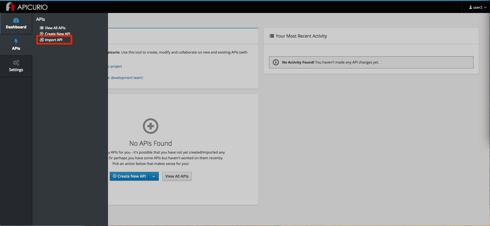
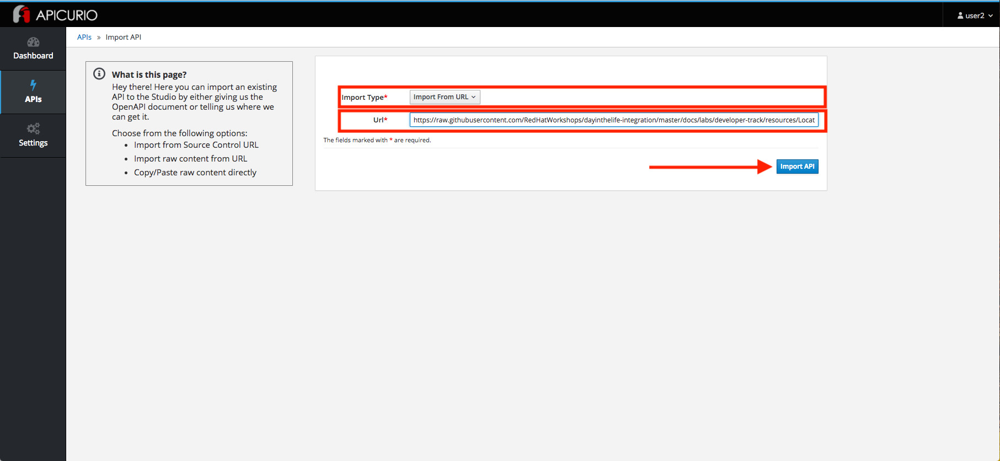
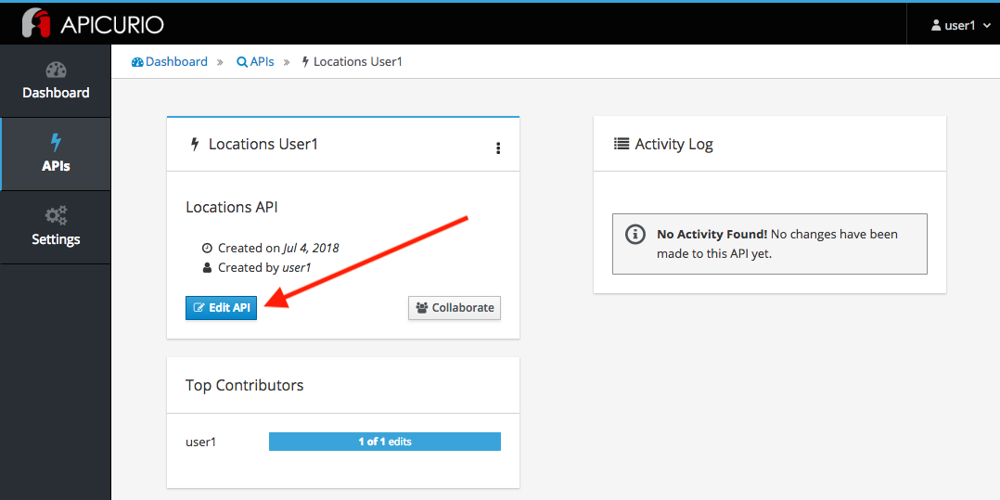
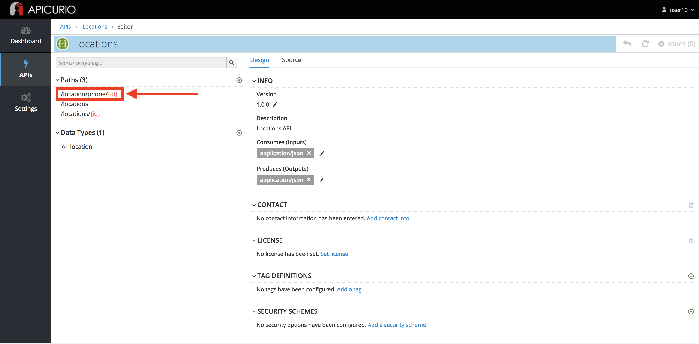
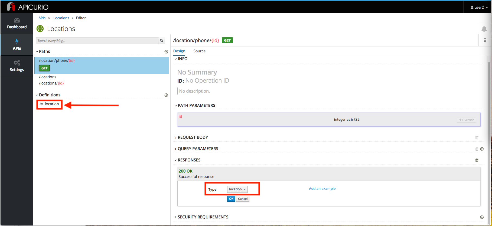
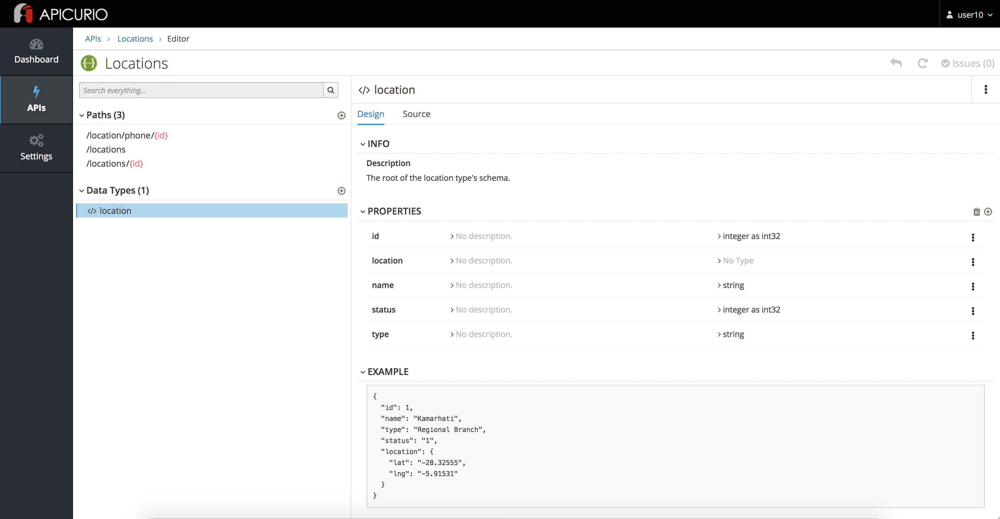
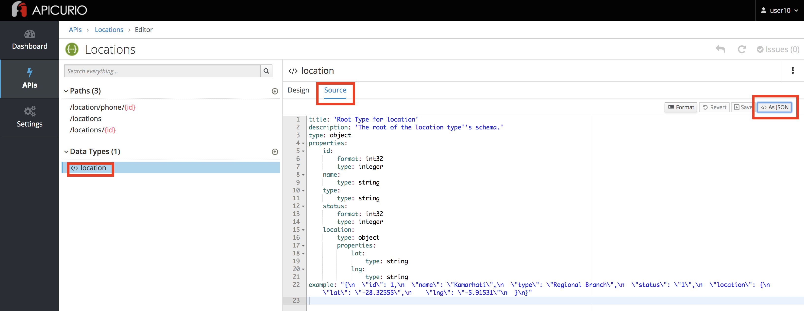

# Lab 1

## API Design

### Import an OpenAPI Specification using Apicurio Studio

* Duration: 10 mins
* Audience: Developers, Architects

## Overview

As APIs become more widespread in the enterprise, consistent design and usage is critically important to improve reusability. The more reusable APIs are, the less friction there is for other internal or external teams to make progress. Having design standards and tools baked into the API development and maintenance process is a very powerful way to enable this consistency.

As a developer, we need to be familiar with API Design even though it's not our core capability.  Therefore, in this lab we will review Red Hat's API Designer product, Apicurio, so that we're familiar with it's capabilities only.

### Why Red Hat?

Red Hat is one of the founding members of the Linux Foundation Open API Initiative (OAI) which produces the leading standard for REST API specifications. Red Hat consistently uses this standard throughout its tooling, starting with the Apicurio Studio API Design editor.

### Skipping The Lab

We know sometimes we don't have enough time to go over step by step on the labs. So here is a [short video](https://youtu.be/FnZwy8KeC-A) where you can see how to create an OpenAPI Specification with Apicurio Studio.

If you are planning to skip this lab and follow the next one, here is a [link](https://github.com/hguerrero/3scaleworkshop-openapi/blob/Lab-01/locations-api/Locations-UserX.yaml) to the specification generated in this lab.

### Environment

**URLs:**

Check with your instruction the *GUID* number of your current workshop environment. Replace the actual number on all the URLs where you find **GUID**. 

Example in case of *GUID* = **1234**: 

```bash
https://master.GUID.openshiftworkshop.com
```

becomes =>

```bash
https://master.1234.openshiftworkshop.com
```

**Credentials:**

Your username is your assigned user number. For example, if you are assigned user number **1**, your username is: 

```bash
user1
```

The password to login is always the same:

```bash
openshift
```

## Lab Instructions

### Step 1: Importing APIs with Apicurio Studio

1. Open a browser window and navigate to:

    ```bash
    http://apicurio-studio.apps.GUID.openshiftworkshop.com/
    ```

1. Accept the self-signed certificate if you haven't: 

    1. If using Google Chrome click the **ADVANCED** link.

      

    1. Then click the **Proceed to..** link to accept the certificate and add the exception.

      

1. Log in using your designated [user and password](#environment).

    

1. Click on **APIs** in the left side navigation menu from the Dashboard page.

    

1. Click on **Import API**.

    

1. Import the API created by your friendly Citizen Integrator:

    * Import Type: **Import From URL**
    * Url: `https://raw.githubusercontent.com/RedHatWorkshops/dayinthelife-integration/master/docs/labs/developer-track/resources/Locations.yaml`

    

1. Click on **Import API**.

1. Finally, click on **Edit API** to walkthrough your newly imported API.

    

### Step 2: Verifying APIs

You are now in the main screen to edit your APIs. Different from other API editor products, Apicurio's Editor is a graphical, form-based editor. With Apicurio you don't need master in and out all the details of the **OpenAPI Specification**. It allows you to design beautiful, functionals APIs with zero coding.

Let's start verifying your API.

1. Time to verify our data definitions for the API. Click on the `location/phone{id}` link under the *Paths*.

    

1. Notice that this API path has a single path parameter (`id` defined as an `int32`) and a single GET operation defined.  Click on the GET operation, then click the Edit button for the 200 OK response.

    

1. Notice that this API path has a single response defined (a `200 OK` response) and the type that is returned is a `location` object.

    

### Step 3: Verify the location object

1. Click on the `</> location` object link under the *Data Types* section.  Notice that the object has a bunch of properties defined which make up the object.

    

1. Click on the source link and notice that we have both YAML and JSON schemas generated by our object design:

    

### Step 4: Verify the /locations path

1. Click the **/locations** path.  Then click on the source tab.  Notice that we have both a GET and POST request defined, together with a couple of example requests.  Using a POST method, we can insert a new record into our sample database with Fuse.

    

*Congratulations!* You have imported your first API definition based on the OpenAPI Specification  using Red Hat's Apicurio. 

## Steps Beyond

So, you want more? Did you notice the link **source** when editing the *Paths* or the *Definitions*? Get back to the API editor and follow the link. What do you see? Apicurio lets you follow the form-based editor or go one step beyond and also lets you direct edit the source of your API definition.

## Summary

In this lab you used Apicurio Studio to import a simple API definition using the OpenAPI Specification (Swagger 2.0). You learned how to author and download a standards compliant API Specification using Red Hat's APICurio.

You can now proceed to [Lab 2](../lab02/#lab-2)

## Notes and Further Reading

* Apicurio
  * [Webpage](https://www.apicur.io)
  * [Roadmap](https://www.apicur.io/roadmap/)
* OpenAPI
  * [OpenAPI Initiative](https://www.openapis.org/)
  * [OpenAPI Specification 3.0.1](https://github.com/OAI/OpenAPI-Specification/blob/master/versions/3.0.1.md)
