# Lab 3

## Swagger to REST

### Contract-first API development with a database interface, implemented using Eclipse Che

* Duration: 20 mins
* Audience: Developers and Architects

## Overview

In the context of defining API's, it's common for a Business Analyst (or Citizen Integrator) to first create an API specification or contract.  By beginning the process with a clearly defined contract, a Developer can easily take the contract and auto-generate the underlying service to implement that API.  This *separation of concern*, whereby a Citizen Integrator and Developer can independently collaborate and contribute to create an end-to-end API implementation, is a powerful method for defining API's.

### Why Red Hat?

Eclipse Che, our online IDE, provides important functionality for implementing API services. In this lab you can see how our API tooling fits together with 3scale, Fuse and OpenShift to create a scalable API.

### Skipping The Lab

We know sometimes we don't have enough time to go over the labs step by step. So here is a [short video](https://youtu.be/-3QGAD3Tt48) where you can see how to implement a contract-first API.

If you are planning to follow to the next lab or are having trouble with this lab, you can reference the working project [here](https://github.com/RedHatWorkshops/dayinthelife-integration/tree/master/projects/location-service)

### Environment

**URLs:**

Check with your instructor which *GUID* number to use for your current workshop environment. Replace the actual number on all the URLs where you find **GUID**. 

Example in case of *GUID* = **1234**: 

```bash
https://master.GUID.openshiftworkshop.com
```

becomes =>

```bash
https://master.1234.openshiftworkshop.com
```

**Credentials:**

Your username is your assigned user number. For example, if you are assigned user number **1**, your username is: 

```bash
user1
```

The password to login is always the same:

```bash
openshift
```

## Lab Instructions

### Step 1: Create an Eclipse Che environment for your personal use

1. Open a browser window and navigate to:

    ```bash
    http://che-rh-che-0879.apps.GUID.openshift.opentlc.com/dashboard/#/
    ```

    *Remember to replace the GUID with your [environment](#environment) value and your user number.*

1. Click on **Create Workspace**.

    

1. Enter a unique name for your workspace e.g. simon-dev-workspace.  Select "day in the life workshop" stack, increase the RAM to 4MB and then click **Create**.

    

1. Click on **Open** to generate and open the workspace.

    


### Step 2: Create your own personal Openshift project and setup a sample database

1. Open a browser window and navigate to:

    ```bash
    http://master.GUID.openshiftworkshop.com
    ```

    *Remember to replace the GUID with your [environment](#environment) value and your user number.*

1. Click on **Create Project** and enter a unique name using your username e.g. `user-X-dev`.

    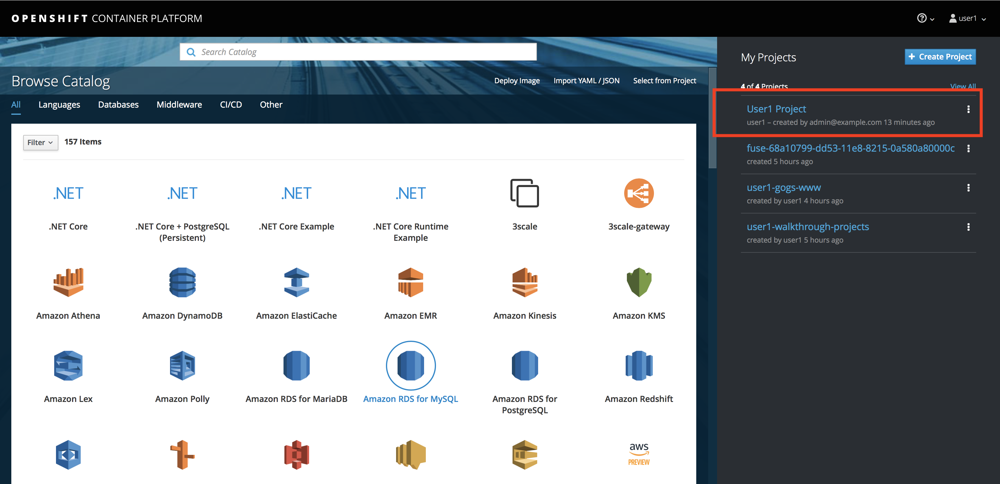

1. Click on **Browse Catalog**, then navigate to the **Databases** menu and select **Postgres**.  From there, select the **PostgreSQL** (Ephemeral) template.

    

1. In the pop-up window that appears, click the **Next** button to reach the **Configuration** page.  Update **PostgreSQL Connection Username** to `dbuser` and **PostgreSQL Connection Password** to `password`.

    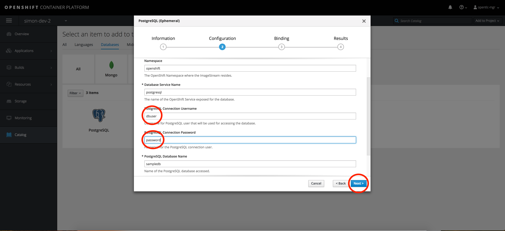

1. Click **Next** and ensure *Do not Bind at this time* is selected.  Click **Create** to generate the service.


### Step 3: Import the sample SOAP project into your Openshift project

1. Navigate back to your Eclipse Che workspace and open the terminal window.

    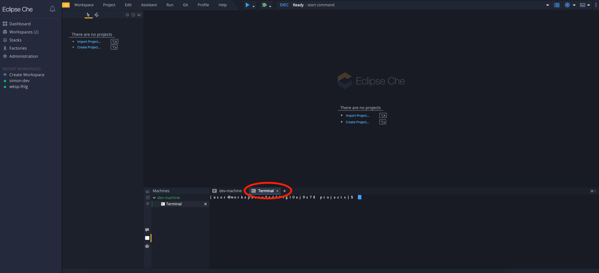

1. Login to Openshift via the Terminal window using the following commands: 

    ```bash
    oc login http://master.GUID.openshiftworkshop.com
    oc project OCPPROJECT
    mkdir OCPPROJECT
    cd OCPPROJECT
    ```

    *Remember to replace the OCPPROJECT with the OpenShift project you created in Step 2.*


1. Clone the sample SOAP project from GitHub, then deploy the project to your Openshift project using s2i binary streams.

    ```bash
    git clone https://github.com/RedHatWorkshops/dayinthelife-integration
    cd dayinthelife-integration/projects/location-soap
    mvn fabric8:deploy
    ```

1. The Maven build / deploy can take 10-15 minutes as it needs to download a bunch of project dependencies (libraries). Please be patient.

1. Once the build and deploy is complete, navigate back to your Openshift web console and verify the project is running.

    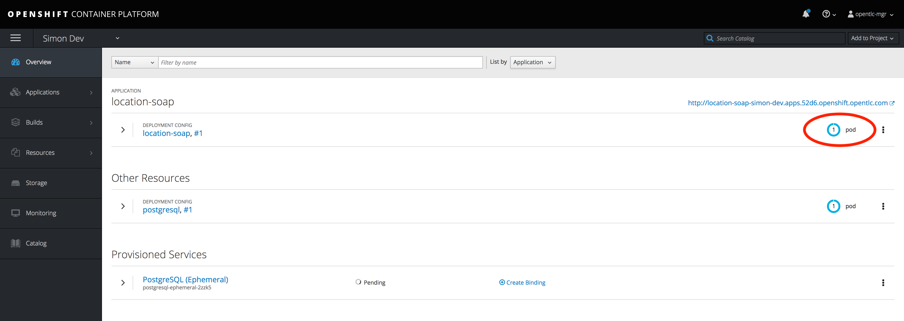

1. You can also try to connect to the route link above the pod, by appending the `/ws/location?wsdl` URI to the end of the link.  This should render the WSDL if the application is running correctly.


### Step 4: Import the skeleton projects from Git and convert them to Maven projects.

1. In Eclipse Che, click on Workspace > Import Project from the main menu.  A pop-up will appear.

    

1. Enter `https://github.com/weimeilin79/dayinthelife-import` as the git URL, select **Import Recursively** and then click **Import**.

1. When the "Save" pop-up appears, click the "X" to close the pop-up.

    

1. Open the dayinthelife-import folder, and right-click on the **location-soap2rest** project and select **Convert to Project**

    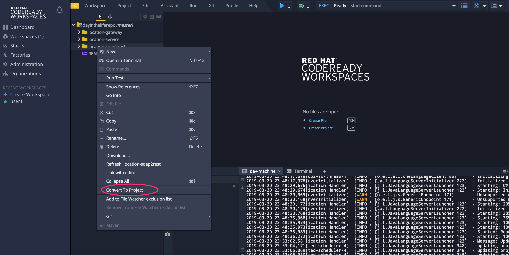

1. Select **Maven** then click **Save**.

    

1. Convert the remaining projects to Maven, by repeating steps 4 & 5 for the **location-service** and **location-gateway** projects.


### Step 4: Import the Swagger specification

Once you've received the swagger specification (API contract) from your friendly Citizen Integrator, we need to import it into our skeleton Maven project (`location-service`).  Follow these steps:

1. Expand the `location-service` project and right-click on the `src` folder, selecting New > Folder.  Give the folder the name `spec`.

    

1. Right-click on your newly created spec folder and select New > File.  Name the file `location.yaml`.

    

1. Copy the contents of this [file](https://raw.githubusercontent.com/RedHatWorkshops/dayinthelife-integration/master/docs/labs/developer-track/resources/Locations.yaml) to your newly created `location.yaml` file.  The file will auto-save so no need to click **Save**.

1. Open the `pom.xml` file, and examine and update the plugin entry for `camel-restdsl-swagger-plugin` located at the bottom of the file.  Update both the `specificationUri` and the `outputDirectory` to have the fully qualified path to your project.  You can find this out by opening terminal, relocating to the dayinthelife-import directory and typing `pwd`.  Your plugin entry should look like this once updated:


    ```xml
	  <plugin>
		  <groupId>org.apache.camel</groupId>
		  <artifactId>camel-restdsl-swagger-plugin</artifactId>
		  <version>2.21.0</version>
		  <configuration>
		    <specificationUri>/projects/dayinthelife-import/location-service/src/spec/location.yaml</specificationUri>
		    <className>CamelRoutes</className>
		    <packageName>com.redhat</packageName>
		    <outputDirectory>/projects/dayinthelife-import/location-service/src/main/java</outputDirectory>      
		  </configuration>
	  </plugin>
    ```

    

1. After you've updated the `pom.xml` file, we need to run a Maven command to generate the Camel RESTdsl from our specification.  To do this, first highlight the `location-service` project then click the **Manage Commands** button.

    

1. Select the **Generate REST DSL from..** script and click **Run** to execute the script. If everything completes successfully, it should generate a new file under `src/main/java/com/redhat` called `CamelRoutes.java`. 

    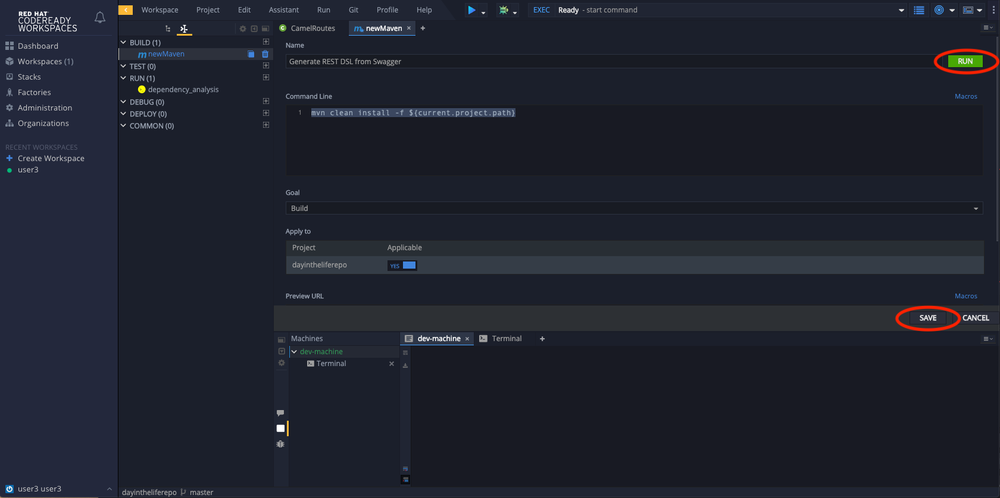

1. Click on the workspace button (located next to the **Manage Commands** button).  Open the `CamelRoutes.java` file under `src/main/java/com/redhat`.  Notice that the `camel-restdsl-swagger-plugin` maven plugin has generated Camel RESTdsl code for the various HTTP GET and POST operations.  What is missing though are the underlying Camel routes, which will form our API service implementations:

    

    ```java
    package com.redhat;
    
    import javax.annotation.Generated;
    import org.apache.camel.builder.RouteBuilder;
    import org.apache.camel.model.rest.RestParamType;
    
    /**
     * Generated from Swagger specification by Camel REST DSL generator.
     */
    @Generated("org.apache.camel.generator.swagger.PathGenerator")
    public final class CamelRoutes extends RouteBuilder {
        /**
         * Defines Apache Camel routes using REST DSL fluent API.
         */
        public void configure() {
            rest()
                .get("/locations")
                    .to("direct:rest1")
                .post("/locations")
                    .to("direct:rest2")
                .get("/locations/{id}")
                    .param()
                        .name("id")
                        .type(RestParamType.path)
                        .dataType("integer")
                        .required(true)
                    .endParam()
                    .to("direct:rest3")
                .get("/location/phone/{id}")
                    .param()
                        .name("id")
                        .type(RestParamType.path)
                        .dataType("integer")
                        .required(true)
                    .endParam()
                    .to("direct:rest4");
        }
    }
    
    ```

1. We need to copy the ContactInfo (location_detail) POJO model over from the `location-soap` project.  Open up the **OCPPROJECT** referenced during Step 3 in the Workspace palette, and navigate to `OCPPROJECT/dayinthelife-integration/projects/location-soap/src/main/java/com/redhat/model/`.  Copy the `ContactInfo.java` file over to the equivalent folder in your own `dayinthelife-import` project.

    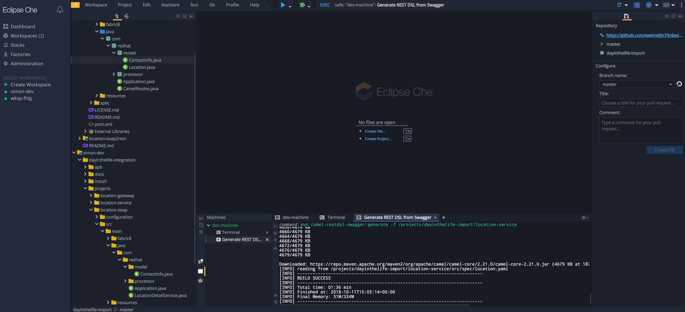
    
1. Rename the `dayinthelife-import/location-service/src/main/java/com/redhat/processor/ResultProcessor.java` file to `LocationProcessor.java`.  You can easily rename the file by right-clicking and selecting **Open in Terminal**.

    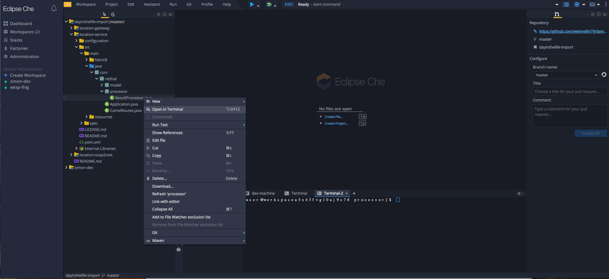

1. To rename the file, type `mv ResultProcessor.java LocationResultProcessor.java` in the terminal window.  Open the new file and update the class name to `LocationResultProcessor`.

    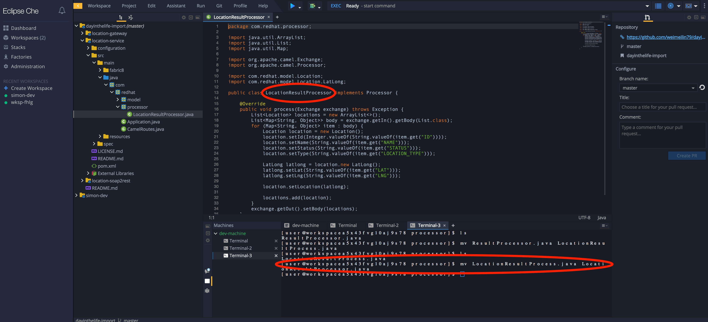

1. Copy the `OCPPROJECT/dayinthelife-integration/projects/location-soap/src/main/java/com/redhat/processor/ResultProcessor.java` file to `dayinthelife-import/location-service/src/main/java/com/redhat/processor/`.  Rename the file to `ContactInfoResultProcessor.java` using the termainal and update the class name appropriately.

    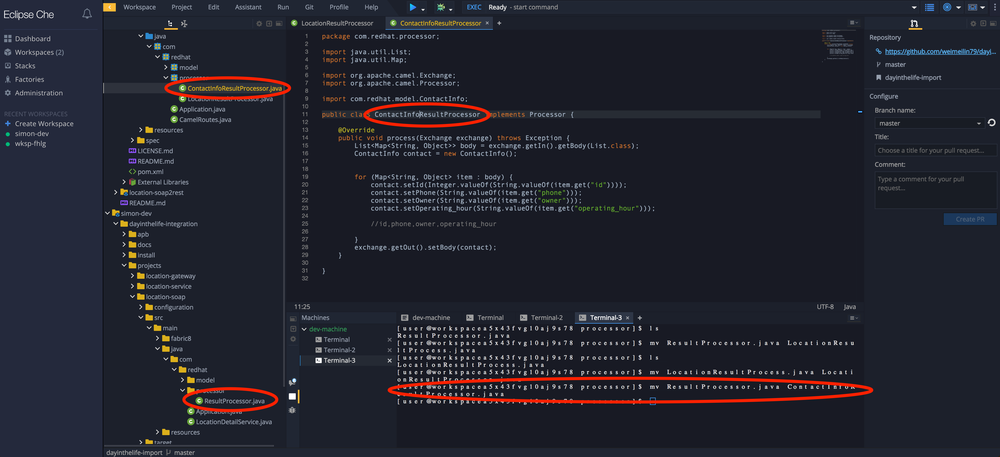

1. Open the generated `CamelRoutes.java` file.  We need to first instantiate our newly created Result Processors' and include the necessary imports.  Update the `CamelRoutes.java` file with the below additions:

    ```java
	...

	import com.redhat.processor.*;
	import com.redhat.model.*;
	import org.springframework.stereotype.Component;
	import org.apache.camel.model.rest.RestBindingMode;

	@Component
	public class CamelRoutes extends RouteBuilder {
	
	...

	@Override
	public void configure() throws Exception {		
		
		ContactInfoResultProcessor ciResultProcessor = new ContactInfoResultProcessor();
		LocationResultProcessor locationResultProcessor = new LocationResultProcessor();
	
		restConfiguration()
			.component("undertow")
        	.port(8080)
        	.bindingMode(RestBindingMode.json)
			.contextPath("/")
        	.dataFormatProperty("prettyPrint", "true")
        	.enableCORS(true)
        	.apiContextPath("/api-doc")
        	.apiProperty("api.title", "Location and Contact Info API")
        	.apiProperty("api.version", "1.0.0")
        ;

	...
    
    ```

    If the IDE has any issues compiling the code and you receive errors, then navigate to **Project > Configure Classpath** then click **Done**.  This will trigger the compiler to run in the background and should eliminate any errors. 

    Notice that we now have both ResultProcessor's instantiated, and we've stood-up an Undertow HTTP listener for our RESTful endpoint, together with some basic self-documenting API docs that describe our new service.

1. Next we need to implement our Camel routes.  We need to create 4 routes, each matching their associated HTTP GET / POST endpoint.  Add the following code below the RESTdsl code:

    ```java
	...
        from("direct:getalllocations")
			.to("sql:select * from locations?dataSource=dataSource")
			.process(locationResultProcessor)
			.log("${body}")
	;
		
	from("direct:getlocation")
			.to("sql:select * from locations where id=cast(:#id as int)?dataSource=dataSource")
			.process(locationResultProcessor)
			.choice()
				.when(simple("${body.size} > 0"))
					.setBody(simple("${body[0]}"))
				.otherwise()
					.setHeader("HTTP_RESPONSE_CODE",constant("404"))
			.log("${body}")
	;
		
        from("direct:addlocation")
            		.log("Creating new location")
			.to("sql:INSERT INTO locations (id,name,lat,lng,location_type,status) VALUES (:#${body.id},:#${body.name},:#${body.location.lat},:#${body.location.lng},:#${body.type},:#${body.status});?dataSource=dataSource")
		;
		
        from("direct:getlocationdetail")
			.to("sql:select * from location_detail where id=cast(:#id as int)?dataSource=dataSource")
			.process(ciResultProcessor)
	;
	...
    ```

1. Lastly, we need to update the RESTdsl code to accommodate our new routes.  Replace the existing RESTdsl with the following:

    ```java
	...
       rest()
            .get("/locations")
                .to("direct:getalllocations")
            .post("/locations")
                .type(Location.class)
                .to("direct:addlocation")
            .get("/locations/{id}")
                .param()
                    .name("id")
                    .type(RestParamType.path)
                    .dataType("integer")
                    .required(true)
                .endParam()
                .to("direct:getlocation")
            .get("/location/phone/{id}")
                .param()
                    .name("id")
                    .type(RestParamType.path)
                    .dataType("integer")
                    .required(true)
                .endParam()
                .outType(ContactInfo.class)
                .to("direct:getlocationdetail")
        ;
    ```

1. Now that we have our API service implementation, we can deploy it to our running OpenShift environment.  To do this, navigate back to the **Manage commands** screen, double-click the **fabric8:deploy** script and hit **Run**.  The script will run and deploy to your OCPPROJECT.

    

1. If the deployment script completes successfully, navigate back to your OCPPROJECT web console and verify the pod is running

    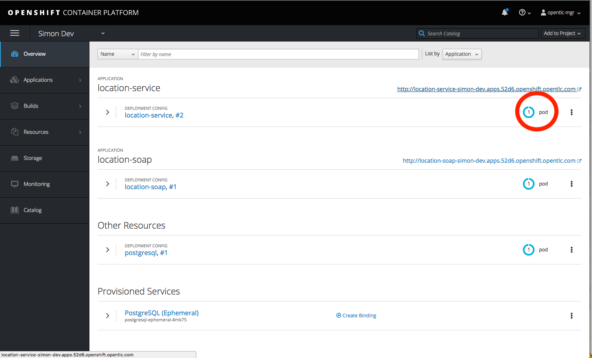

1. Click on the route link above the location-service pod and append `locations` to the URI.  As a result, you should receive a list of all locations

    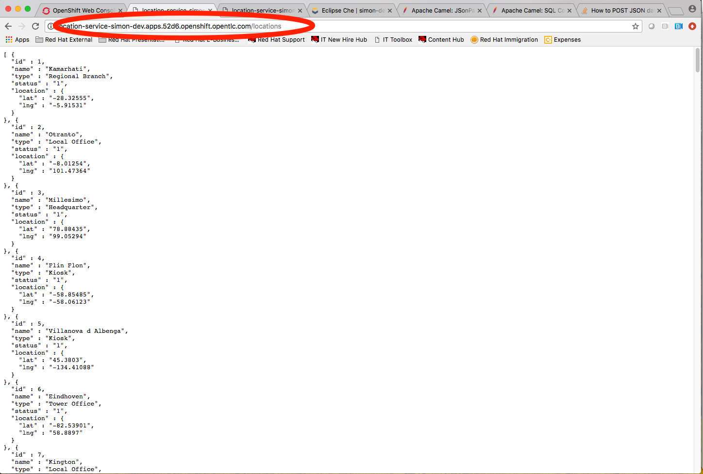

1. You can also search for individual locations by adjusting the URI to `/locations/{id}` e.g. `/locations/100`.

1. Lastly, via the Eclipse Che terminal, test the HTTP post using curl.  You can use the following command:

    ```bash
	curl --header "Content-Type: application/json" --request POST --data '{"id": 101,"name": "Kakadu","type": "HQ","status": "1","location": {"lat": "78.88436","lng": "99.05295"}}' http://location-service-OCPPROJECT.apps.GUID.openshift.opentlc.com/locations
    ```

    Remember to replace OCPPROJECT and GUID with your unique environment variables.

1.  If the HTTP POST is successful, you should be able to view it by repeating the HTTP GET /locations test.

*Congratulations!* You have now an application to test your Swagger to RESTdsl integration.

## Summary

You have now successfully created a contract-first API using a Swagger contract together with generated Camel RESTdsl, incorporating both HTTP GET and POST requests that perform select and inserts on a Postgres database table.

You can now proceed to [Lab 4](../lab04/#lab-4)

