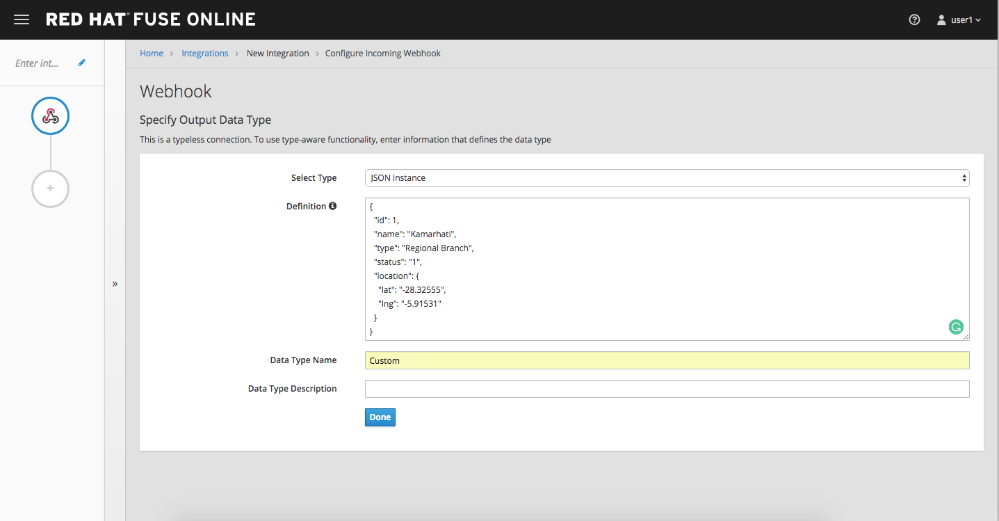
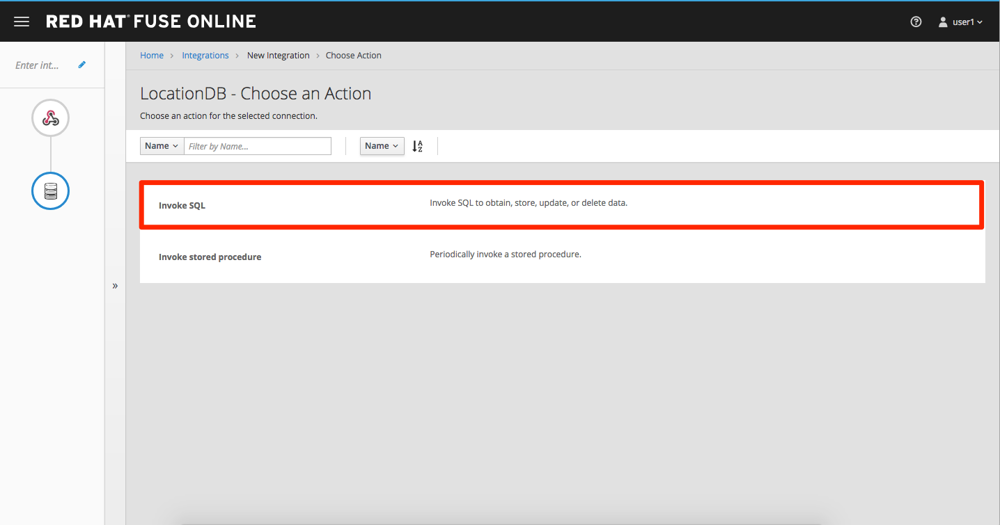
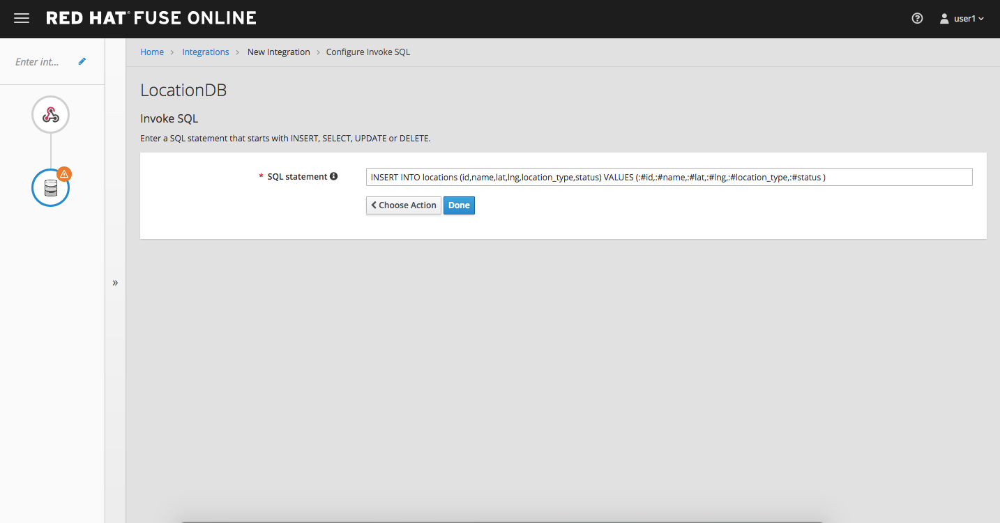
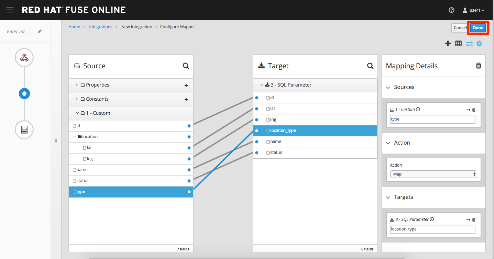
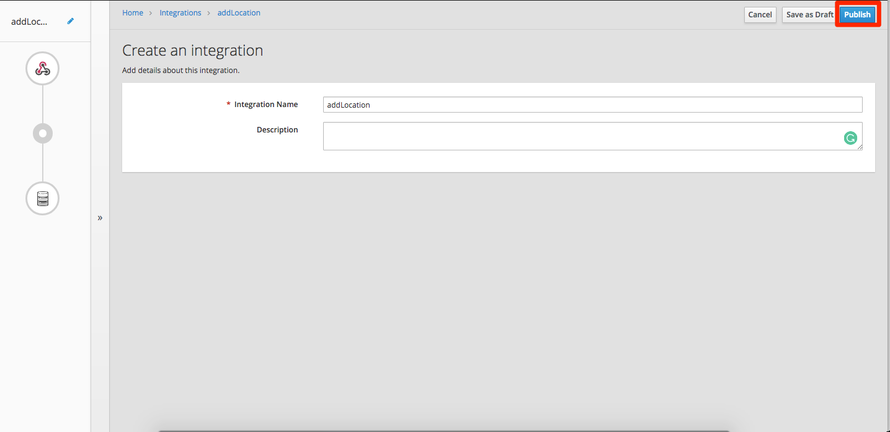
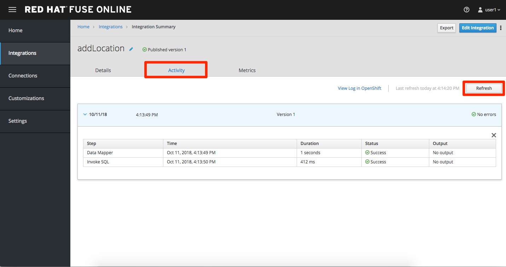

# Lab 5

## Fuse Online

## todo

* Duration: 20 mins
* Audience: Developers and Architects

## Overview

When it comes to quick API development, you need both the integration experts as well as application developers to easily develop, deploy the APIs.Here is how to create an simple API with Fuse online. 

### Why Red Hat?

Red Hat Fuse integration solution empowers integration experts, application developers, and business users to engage in enterprise-wide collaboration and high-productivity self-service. 

### Skipping The Lab
We know sometimes we don't have enough time to go over the labs step by step. So here is a [short video](https://youtu.be/-3QGAD3Tt48) where you can see how to implement a contract-first API.

### Environment

**URLs:**

Check with your instruction the *GUID* number of your current workshop environment. Replace the actual number on all the URLs where you find **GUID**. 

Example in case of *GUID* = **1234**: 

```bash
https://master.GUID.openshiftworkshop.com
```

becomes =>

```bash
https://master.1234.openshiftworkshop.com
```

**Credentials:**

Your username is your asigned user number. For example, if you are assigned user number **1**, your username is: 

```bash
user1
```

The password to login is always the same:

```bash
openshift
```

## Lab Instructions

### Step 1: Create database connection

1. Open a browser window and navigate to:

    ```bash
    http://https://syndesis-user1.apps.GUID.openshift.opentlc.com/
    ```

    *Remember to replace the GUID with your [environment](#environment) value and your user number.*

1. Click on **Connection > Create Connection**

   

1. Select **Database**

   

1. Enter below values for Database Configuration

    ```
    Connection URL: jdbc:postgresql://postgresql.user1.svc:5432/sampledb
    Username      : dbuser
    Password      : password
    Schema        : keep it empty
    ```

1. Click **Validate** and verify if the connection is successful. Click **Next** to proceed.

  

6. Add `Connection details`. `Connection Name: LocationDB` and `Description: Location Database`. Click **Create**.
   
   

7. Verify that the `Location Database` is successfully created.

### Step 2: Create webhook integration

Description goes here

1. Click on **Integration > Create Integration** 

  

2. Choose **Webhook**

  

3. Click on `Incoming webhook` 

  

4. It navigates to the `Webhook Token` screen. Click **Next**

  

5. Define the Output Data Type. `Select type` from the dropdown as `JSON instance`. Enter `Data type Name: Custom`. `Defination: `, copy below JSON data.

    ```
		{
		  "id": 1,
		  "name": "Kamarhati",
		  "type": "Regional Branch",
		  "status": "1",
		  "location": {
		    "lat": "-28.32555",
		    "lng": "-5.91531"
		  }
		}
    ```

  **Screenshot**

 

6. Click on `LocationDB` from the catalog and then select `Invoke SQL`

 

7. Enter the SQL statement and click **Done**.

 ```
   INSERT INTO locations (id,name,lat,lng,location_type,status) VALUES (:#id,:#name,:#lat,:#lng,:#location_type,:#status )
 ```

 **Screenshot**

 

8. Click on `Add step` and select `Data mapper`

 

9. Drag and drop the matching `Source` Data type to the `Target`. Click **Done**

 

10. Click **Publish** on the next screen and add `Integration Name: addLocation`. Again Click **Publish**.

 

*Congratulations*. You sucessfully published the integration. (Wait for few minutes to build and publish the integration)

### Step 3: Create a POST request

1. Copy the External URL and form a POST request like below. We will be creating the `101th` record field.   

 

*Remember to replace the below hostname with the copied URL*

**CURL POST request**

  ```
    curl -X POST \
      https://i-addlocation-vinay.apps.rhtena.openshiftworkshop.com/webhook/pUGTWtLu8nnVTNJ1JYIsThcrKyMJAxBJMRURvRVEHSSvoMExTk \
      -H 'Content-Type: application/json' \
      -d '{
        "id": 101,
        "name": "Kamarhati",
        "type": "Regional Branch",
        "status": "1",
        "location": {
          "lat": "-28.32555",
          "lng": "-5.91531"
        }
      
  }' -k
  ```

2. Click on **Activity > Refresh** and verify if the newly record is created.

 

3. (Optional) Visit the application URL in browser and verify if the recoard can be fetched.

  ```
  http://location-service-user1.apps.rhtena.openshiftworkshop.com/locations/101
  ```


  ```
  {
    "id" : 101,
    "name" : "Kamarhati",
    "type" : "Regional Branch",
    "status" : "1",
    "location" : {
      "lat" : "-28.32555",
      "lng" : "-5.91531"
    }
  }
  ```

## Summary

In this lab you discovered how to create an adhoc API service using Fuse Online. 

You can now proceed to [Lab 6](../lab06/#lab-6)


## Notes and Further Reading

TBD


