# Lab 7

## API Developer Portal

### Publishing APIs to Developer Portal

* Duration: 20 mins
* Audience: API Owners, Product Managers, Developers, Architects

## Overview

The focal point of your developers’ experience is the API developer portal, and the level of effort you put into it will determine the level of decreased support costs and increased developer engagement.

### Why Red Hat?

3scale provides a built-in, state-of-the-art CMS portal, making it very easy to create your own branded hub with a custom domain to manage developer interactions and increase API adoption.

You can customize the look and feel of the entire Developer Portal to match your own branding. You have complete control over every element of the portal, so you can make it as easy as possible for developers to learn how to use your API.

### Environment

**Credentials:**

Your username is your assigned user number. For example, if you are assigned user number **1**, your username is: 

```bash
user1
```

Please ask your instructor for your password.

**URLs:**

If you haven't done so already, you need to login to the **Red Hat Solution Explorer** webpage so that a unique lab environment can be provisioned on-demand for your exclusive use.  You should open a web browser and navigate to: 

```bash
https://tutorial-web-app-webapp.dil1.opentry.me
```

You will be presented with a login page where you can enter your unique credentials:


Enter your credentials and click **Log in**.  You'll notice a web-page appear which explains that a *unique environment* is being provisioned.


Once the environment is provisioned, you will be presented with a page that presents all the available applications which you'll need in order to complete the labs:

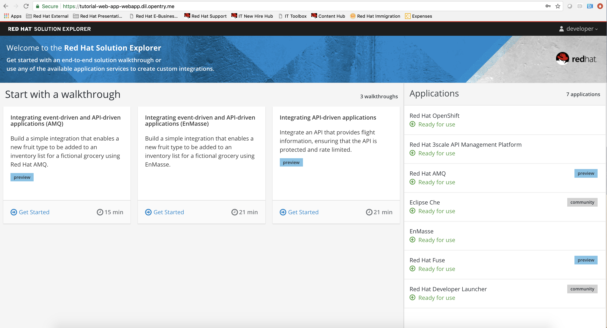

## Lab Instructions

### Step 1: Customizing Developer Portal

1. Open a browser window and navigate to:

    ```bash
    https://userX-admin.dil1.opentry.me/p/login
    ```

    *Remember to replace `X` with your user number.*

1. Accept the self-signed certificate if you haven't.

1. Log into 3scale using your designated [user and password](#environment). Click on **Sign In**.

    

1. Click on the **Developer Portal** tab to access the developer portal settings.

    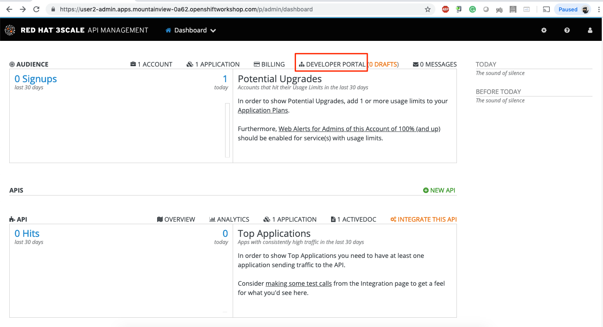


1. On the right menu select **Home Page**, and replace the entire content with what's in the example link [example](https://raw.githubusercontent.com/RedHatWorkshops/dayinthelife-integration/master/docs/labs/developer-track/lab07/support/homepage.example)

	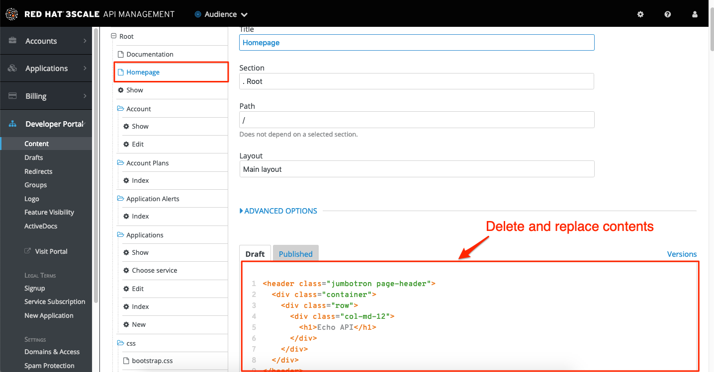

1. Replace the CHANGE_ME_URL to the PLAN_URL you get from last lab.

	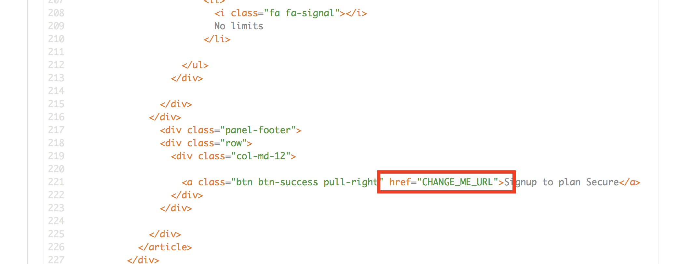
	
	
1. Click the *Publish* button at the bottom of the editor to save the changes and made them available in the site.

    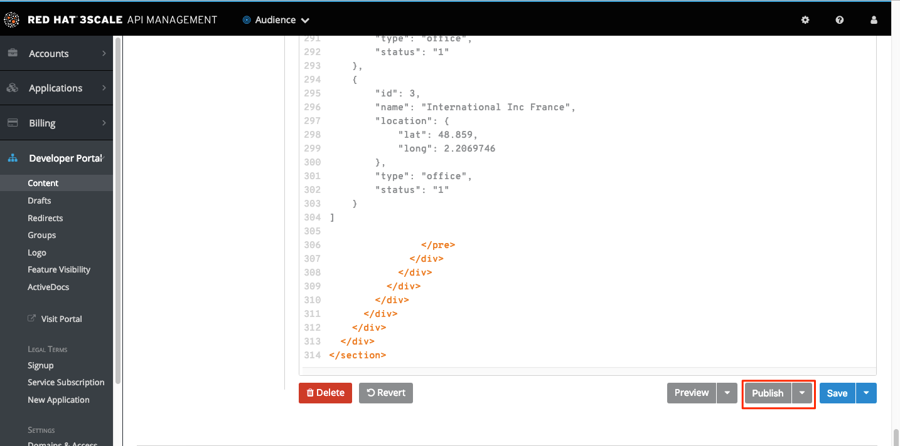

1. Click on the **API** Tab, select the **Integration** link under **SSO Location API**, and click on the **Application Plans** on the left menu when it shows up. And publish your application plan by clicking in on the **Publish** option on the page.  

	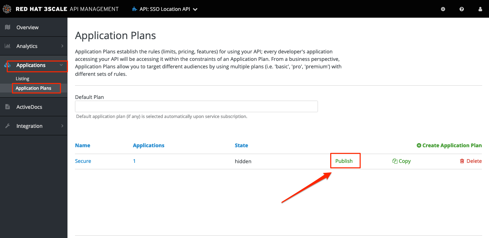
	
	

1. Go back to your **Developer Portal** tab. Click on the **Visit Developer Portal** to take a look of how your developer portal looks like.

    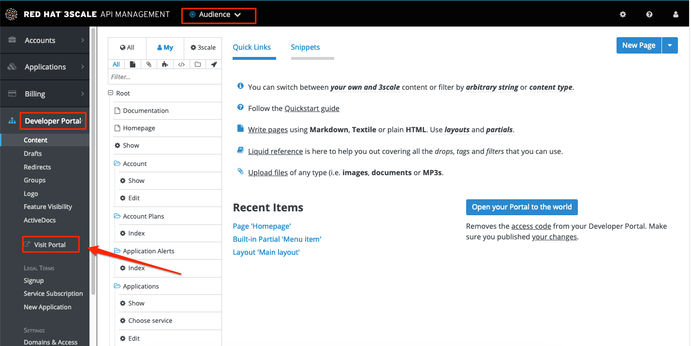

### Step 2: Register New Accounts Using Developer Portal

1. Take the place of one of your developers and signup for the **Secure** plan.

    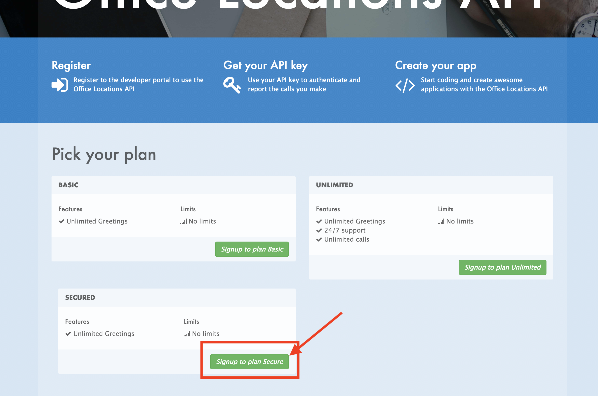

1. Fill in your information and an email to register as a developer. Click on the **Sign up** button.

    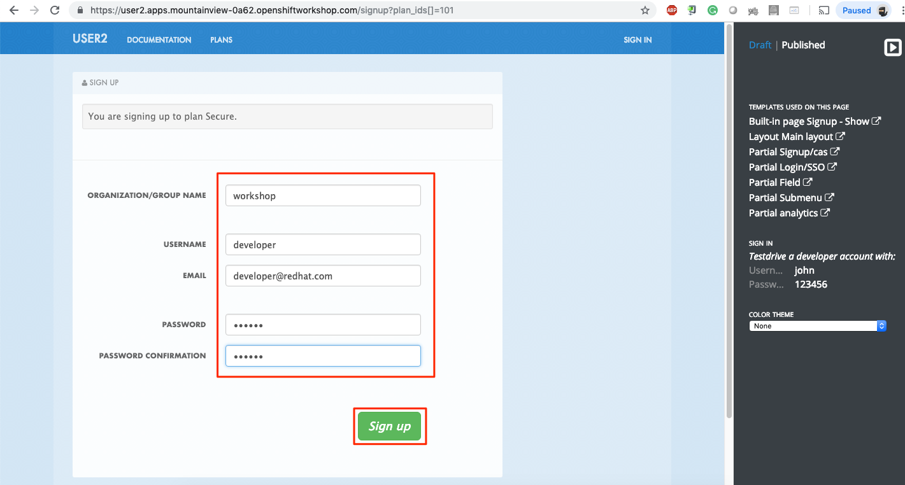

1. The system will try to send a message with an activation link.

    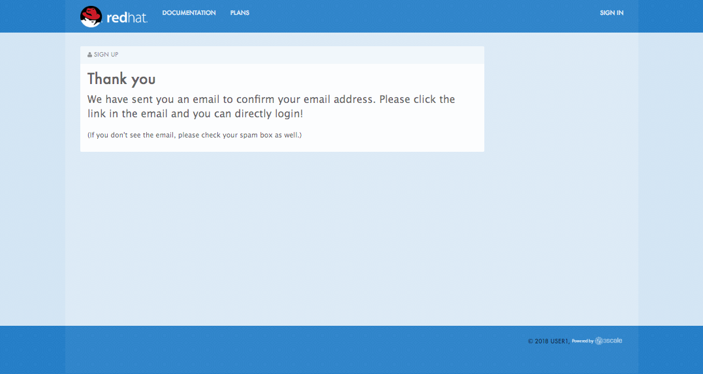

    *Currently the lab environment doesn't have a configured email server, so we won't be able to receive the email*.

1. Go back to your *Admin Portal* tab and navigate to **Developers** to activate the new account.

    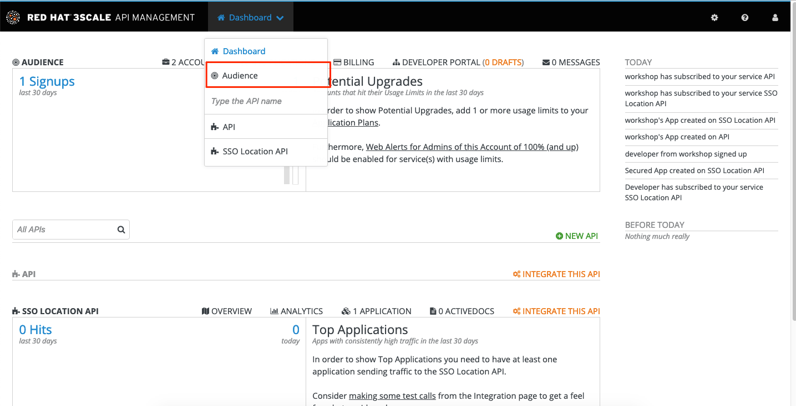

1. Find your user under the *Accounts* and click the **Activate** link.

    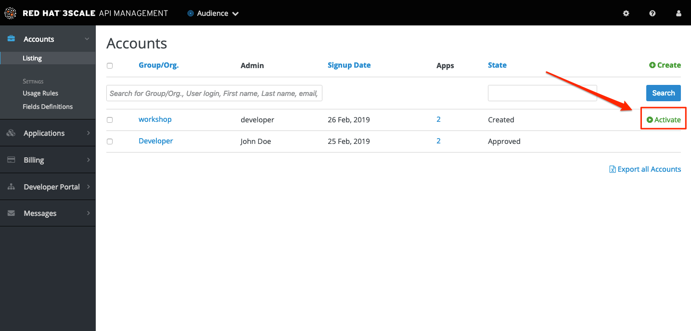

    *Your user is now active and can log into the portal*.
    
1. Now we need to make sure the the application will redirect the user to the correct page after successful login. Go to the Developer tab and click on the user you have create in the previous steps.

	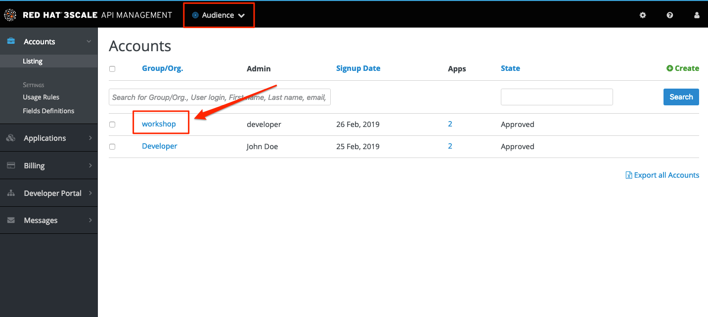

1. Select the application for the `SSO Location API` service

	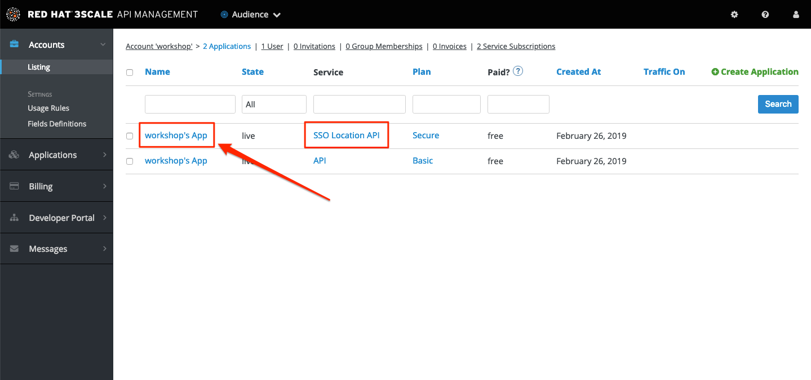

1. Update redirect link to http://www-userX.dil1.opentry.me/*

	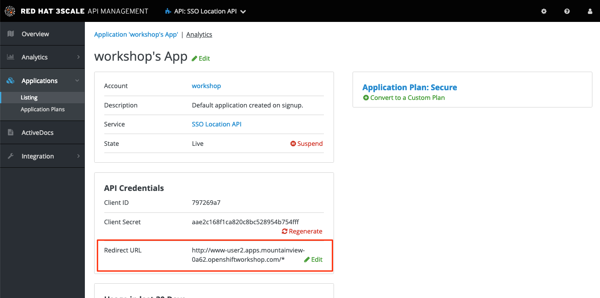

### Step 3: Login to Developer Portal

1. As your portal is not currently public, you will need your portal code to login. You can get the code in your admin portal navigating to: **Settings > Developer Portal > Domains &amp; Access**.

    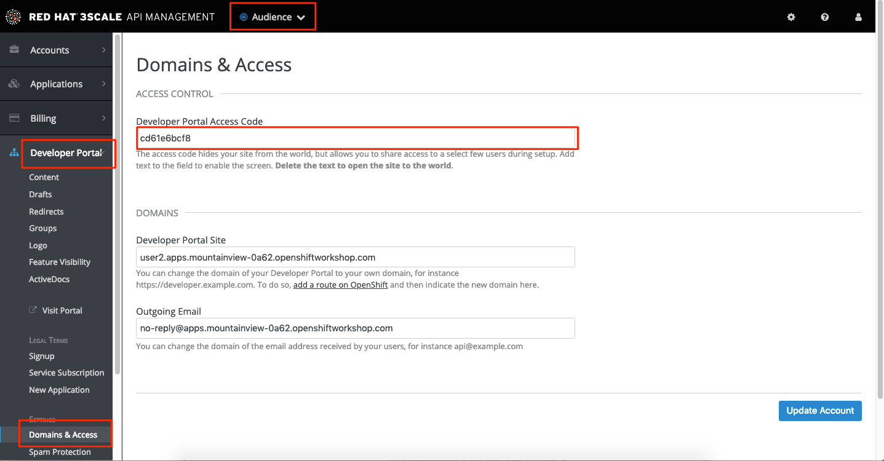

1. Open a new *Incognito/Private* browser window to test the Developer Portal login. Navigate to:

    ```bash
    https://userX.dil1.opentry.me/
    ```

1. Type your portal code to finish the login.

    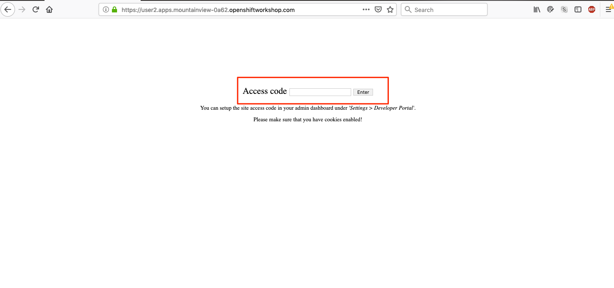

1. Sign in to the portal.

    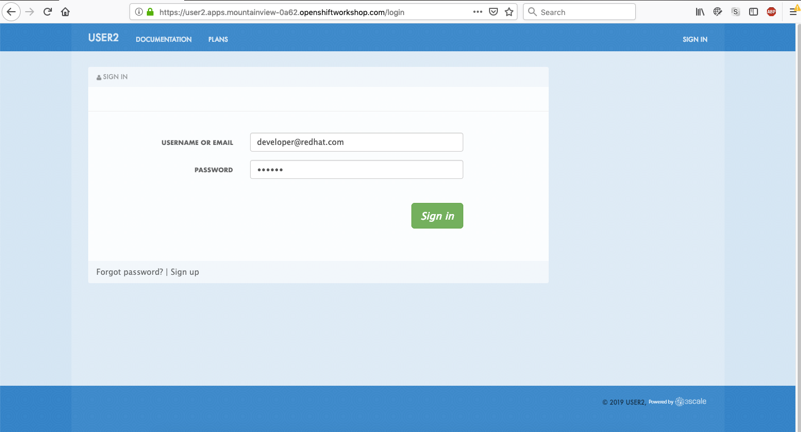

1. You will land in the developers homepage, where you will be able to check your developers settings and retrieve your newly created **Client ID** and **Client Secret**.

    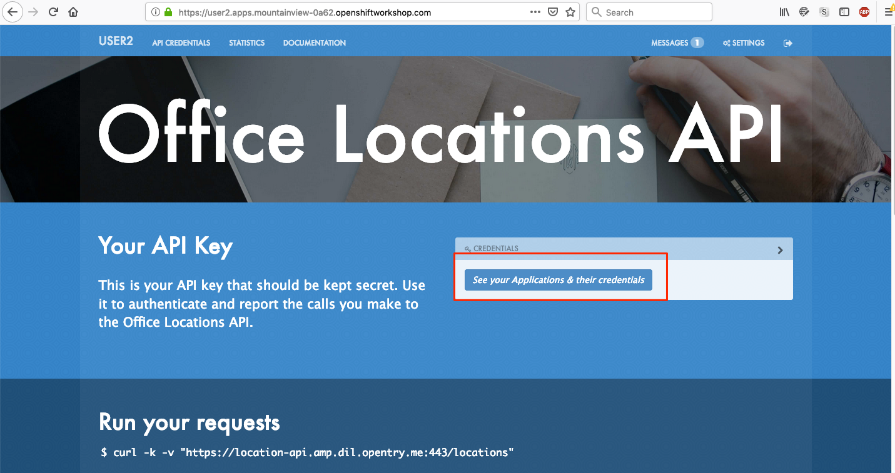

    *Copy down this credentials as it you will use them to authenticate yourself to the managed API*.

*Congratulations!* You have successfully customized your Developer Portal and completed a Sign Up process.

## Steps Beyond

So, you want more? Click the **Documentation** link. Where does it takes you? *API Docs* is where you can add your interactive documentation for your APIs. Is based on the known *Swagger UI* interface.

You can add from the Admin Portal under *API Docs* the API definition to generate the live testing.

## Summary

In this lab you discovered how to add a developer facing experience to your APIs. Developers in your organization or outside of it can now register, gain access to API keys and develop sample applications.

You can now proceed to [Lab 8](../lab08/#lab-8)

## Notes and Further Reading

Red Hat 3scale Developer Portal's CMS consists of a few elements:

* Horizontal menu in the Admin Portal with access to content, redirects, and changes
* The main area containing details of the sections above
* CMS mode, accessible through the preview option

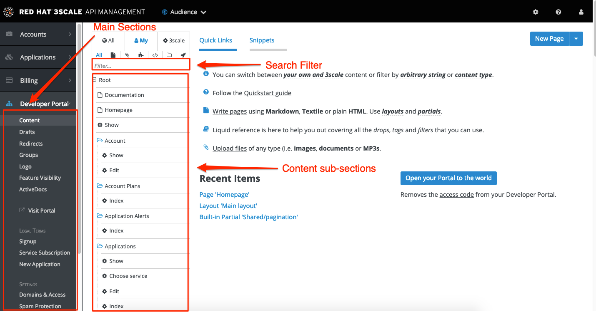

[Liquid](https://github.com/Shopify/liquid) is a simple programming language used for displaying and processing most of the data from the 3scale system available for API providers. In 3scale, it is used to expose server-side data to your API developers, greatly extending the usefulness of the CMS while maintaining a high level of security.

### Links

* [Developer Portal Documentation](https://access.redhat.com/documentation/en-us/red_hat_3scale/2.2/html/developer_portal/)
* [Liquid markup language](https://github.com/Shopify/liquid)
* [And Overview of Liquid](https://www.shopify.com/partners/blog/115244038-an-overview-of-liquid-shopifys-templating-language)
